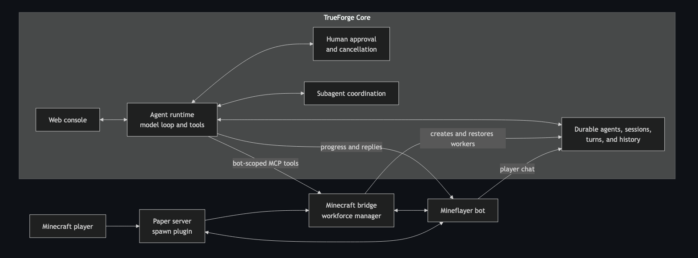

# MineForge: a TrueForge Harness Modification, reviewed by Qodo

MineForge connects AI workers in a Minecraft world to TrueForge. TrueForge runs the intelligence and conversation; the bridge translates approved agent decisions into bounded Minecraft actions. In this project we essentially created a custom Minecraft MCP and wired it to the MineForge console and harness.

Code is not the only thing agents / harness should be good at!

## How it works

_TrueForge remains the harness and interface._ It owns the model loop, agent instructions, durable sessions, conversation history, tool approval, cancellation, and subagent coordination. _The Minecraft bridge does not run a separate agent loop._

The bridge owns the physical workforce. Each worker has:

- one Mineflayer bot in Minecraft;
- one TrueForge agent and durable session;
- one private MCP route connected only to that bot;
- one active plan boundary; and
- one action queue that prevents overlapping world changes.

When a player runs `/spawn X`, the Paper plugin asks the bridge for a neutral worker. The bridge connects the bot, provisions an empty TrueForge session, and records the relationship so it can be restored after a restart. Paper then places the bot on safe ground with the same neutral starting kit. The user's first console prompt determines whether it gathers wood, hunts for food, or builds from a blueprint.

TrueForge decides what each worker does from the user's console prompt, calls that worker's MCP tools, and sends progress or final replies back through Minecraft chat. Cancelling or failing a turn immediately stops the bot and invalidates its active plan.

## Safe world actions

World-changing work requires a human-approved plan. A plan limits which actions are allowed, how long authorization lasts, and how far the bot may travel or modify the world. Those limits are checked again while an action is running, not only when it begins.

The bridge exposes bounded observation, movement, gathering, crafting, and building behavior. It does not expose unrestricted server commands, explosives, hostile combat, or arbitrary world mutation.

## Building crews and blueprints

A worker assigned a building task can import a supported GrabCraft design into a local blueprint catalog. The bridge validates and normalizes the design, removes unsupported blocks, calculates its material list, and gives the result an immutable digest.

Before construction, TrueForge separately asks for approval to enable creative mode, create visible helper bodies, and bind the build plan to the exact blueprint digest and location. TrueForge subagents coordinate the work, while the bridge routes deterministic batches to the lead bot or a helper.

Every target block is checked against the approved plan and the live Minecraft world. Already-correct blocks are skipped, so an interrupted batch can be retried safely.

## Responsibilities

| Component        | Responsibility                                                                          |
| ---------------- | --------------------------------------------------------------------------------------- |
| TrueForge        | Agent reasoning, sessions, approvals, cancellation, history, and subagents              |
| Minecraft bridge | Bot lifecycle, MCP tools, plans, action queues, chat mirroring, and blueprint execution |
| Paper plugin     | Player spawn requests, safe placement, starting kits, skins, and placement rollback     |
| Minecraft server | Authoritative world state                                                               |
